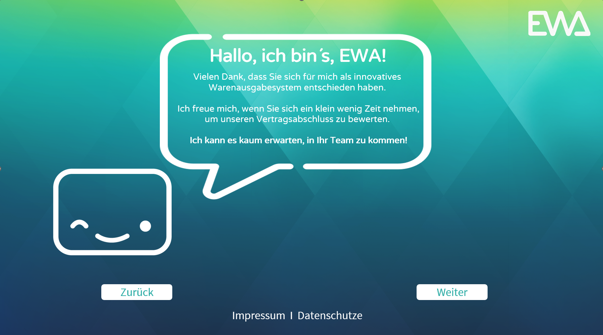
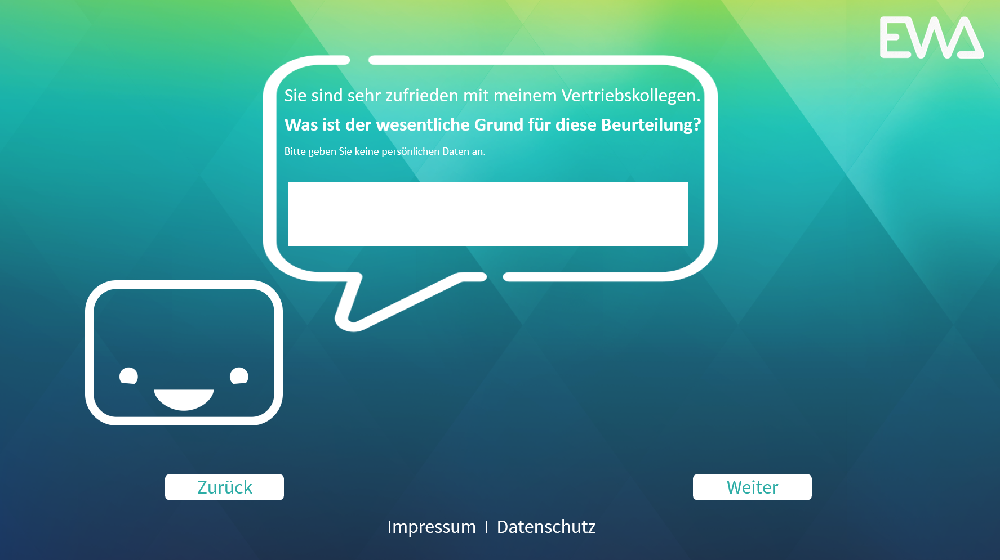
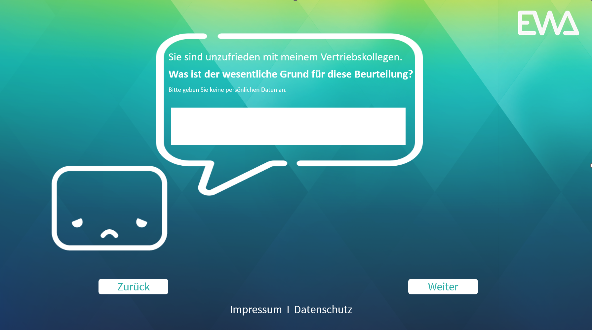

# tobaccoland CX

### In this repository we will :
- Change the background
- Smiley in white color
- and a white bubble as a border
- Animate a smiley and make it wink on the home page.

[Project link](https://skopos.qualtrics.com/survey-builder/SV_5ziy3D3hyzUnH0y/edit)

## the final design proposal

1. First page

2. very satisfied

3. very dissatisfied

## **devDependencies :**
- [npm install --save-dev webpack](https://webpack.js.org/guides/installation/)

- [npm i less](https://www.npmjs.com/package/less)

- [npm i less-loader](https://www.npmjs.com/package/less-loader)

- [npm i nodemon](https://www.npmjs.com/package/nodemon)

- [npm i webpack-cli](https://www.npmjs.com/package/webpack-cli)